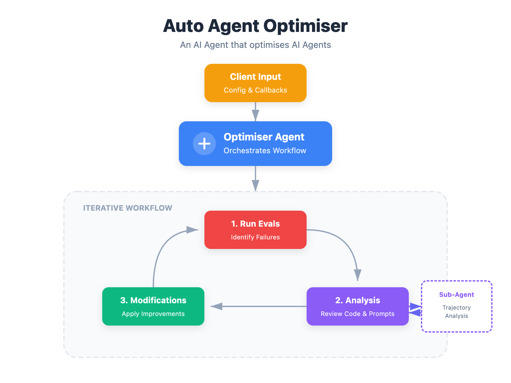

# Auto Agent Optimiser: An AI Agent that tunes other AI Agents

> **Proof of Concept** - The core architecture has been validated and includes Terminal Bench integration. It's also designed to be extendable - plug in your own agents and evals. Extended testing (continuous optimisation over many iterations) wasn't completed due to time and cost constraints. See [Status](#status) for details.

## What is this?

An AI agent that improves other AI Agents by:
- Modifying system messages
- Tweaking tool implementations
- Running evaluations to measure performance
- Analysing failed evaluations (using subagents)
- Iterating until optimisation goals are met



## How it works

1. **Input**: Provide a project breakdown (describing the target system) and an eval callback
2. **Optimise**: The optimiser agent reads target system files, suggests and applies improvements
3. **Evaluate**: Each iteration is tested against the eval suite via your callback
4. **Iterate**: Process repeats until performance targets are reached or the agent finishes

## Architecture

### Overview

The system has three main components:

```
┌─────────────────────────────────────────────────────────────────┐
│                        Client Code                              │
│  ┌──────────────────────┐    ┌──────────────────────────────┐   │
│  │  Project Breakdown   │    │      Eval Callback           │   │
│  │  (YAML config)       │    │  (runs target agent evals)   │   │
│  └──────────┬───────────┘    └──────────────┬───────────────┘   │
└─────────────┼───────────────────────────────┼───────────────────┘
              │                               │
              ▼                               ▼
┌─────────────────────────────────────────────────────────────────┐
│                      OptimiserAgent                             │
│                                                                 │
│  • Reads/writes target system files                             │
│  • Analyses eval results                                        │
│  • Makes iterative improvements                                 │
│  • Spawns trajectory analysis subagents                         │
│                                                                 │
└─────────────────────────────────────────────────────────────────┘
              │
              │ modifies
              ▼
┌─────────────────────────────────────────────────────────────────┐
│                 Target System (Client Code)                     │
│                                                                 │
│  The AI agent being optimised (system message, tools, etc.)     │
│                                                                 │
└─────────────────────────────────────────────────────────────────┘
```


### Client Responsibilities

The client provides two key inputs:

1. **Project Breakdown** - A YAML configuration describing the target system:
   - `key_files`: Important files and their purposes (system messages, tool implementations)
   - `available_actions`: What the target agent can do
   - `editing_guidelines`: Constraints for the optimiser (*optional)
   - `known_limitations`: Any known limitations of this agent (*optional)

2. **Eval Callback** - A function that runs evaluations against the target system and returns results. The optimiser calls this to measure the impact of its changes.

### OptimiserAgent

The core agent that performs optimization. It operates in **iterations**:

1. **Analyze** - Review eval results, identify failing evals
2. **Investigate** - Read target system files, optionally spawn trajectory analysis subagents
3. **Modify** - Make targeted changes to improve the target system
4. **Test** - Run specific evals to validate changes
5. **End Iteration** - Run full eval suite, collapse context, proceed to next iteration

#### Context Collapse

At the end of each iteration, message history is reset to prevent unbounded context growth. Only essential state is preserved:
- Optimisation history (what changed, what improved)
- Current project breakdown (updated by the optimisation agent)
- Known limitations (evals deemed not worth pursuing)

#### Subagents

For individual trajectory analysis, the optimiser can spawn **trajectory analysis subagents** that have access to the full eval trajectory (the target agent's conversation history during the eval). This helps diagnose why the target agent behaved incorrectly without overloading the context window of the main agent.

### Actions

The OptimiserAgent communicates exclusively via JSON actions:

| Action | Purpose |
|--------|---------|
| `read` | Read target system files |
| `write` / `edit` / `multi_edit` | Modify target system files |
| `bash` | Execute shell commands |
| `run_eval_suite` | Run specific evals to test changes |
| `end_iteration` | Run full suite, collapse context |
| `reset_to_iteration` | Reset files and project breakdown to a previous iteration's state |
| `dispatch_traj_analysis_agent` | Analyze a failed eval's trajectory |
| `send_subagent_message` | Continue conversation with subagent for follow up questions after analysis |
| `update_project_breakdown` | Update file/action descriptions |
| `finish` | Complete optimization |

### Optimisation Philosophy

The system is designed to improve **general capability**, not maximize test scores:

- Prefer changes to core reasoning over adding specific rules
- Adds/enhances tools when the agent lacks capability
- Mark evals as "known limitations" after 2-3 failed attempts
- Accept non-determinism (most attempts passing is often sufficient)

## Status

**Proof of Concept** - Development paused.

This project was built to explore whether an AI agent could systematically improve other AI agents through iterative optimisation. The core architecture works, and simple scenarios have been validated:

- **Real LLM tests** demonstrate that Claude-4.5-Sonnet can identify and fix obvious bugs in target agents
- The iteration loop, context collapse, trajectory analysis subagents, and file modification pipeline all function as designed

### What was tested

The scenarios in this repo test relatively simple cases: fixing an obvious bug in tool code, correcting a broken system message, and adding a missing tool. These validate the core mechanics work.

### What wasn't tested

The original vision was more ambitious:

1. **Continuous Terminal Bench optimisation** - Start with a simple agent (file read/write/edit, bash, maybe subagent dispatch) and run the optimiser against Terminal Bench evaluations over many iterations to see if accuracy improves over time.

2. **Improving an existing benchmark agent** - Take Stanford's [Terminus 2](https://www.tbench.ai/terminus) agent and see if the optimiser could improve its Terminal Bench scores, effectively creating a "Terminus 2.1".

3. **A CLI tool installable via uv** - So users can use it easily on their own projects with a simple uv command.

Both of these require significant compute time and API costs - running the optimiser agent plus hundreds of Terminal Bench evaluations per iteration adds up quickly.

### Why development paused

Time and resource constraints. These experiments would require sustained investment in API costs and debugging time that isn't available right now.

### Taking this further

If you're interested in continuing this work, the infrastructure is here:
- The Terminal Bench integration via Harbor is implemented
- Trajectory analysis subagents can diagnose why target agents fail specific evals
- The iteration loop handles context collapse and state preservation

The main work would be running extended optimisation sessions against real benchmarks and refining the optimiser's strategy based on what works.

### Future ideas

Some directions this project could go:

- **Parallel experiment rollout** - Instead of making one change at a time, the optimiser could spawn multiple subagents to try different approaches concurrently (using git branches or similar), then pick the best result based on eval scores. Similar to how GRPO works for RL.

- **User-in-the-loop CLI** - Let users approve changes before they're applied, offer suggestions to the optimiser, and use git integration so changes can be monitored and manually reverted.

- **Configurable stopping conditions** - Let users specify when to finish (e.g., "stop when >90% of evals pass" or "stop after 5 iterations without progress").

## Testing

### Configuration

The following environment variables are used to configure LLM access:

| Variable | Description | Required |
|----------|-------------|----------|
| `LLM_MODEL` | Model identifier for the optimiser agent (e.g., `openrouter/anthropic/claude-sonnet-4.5`) | Yes |
| `LLM_API_KEY` | API key for the optimiser agent's LLM provider | Yes |
| `TARGET_LLM_MODEL` | Model identifier for the target agent being optimised (used in scenario tests) | For tests |
| `TARGET_LLM_API_KEY` | API key for the target agent's LLM provider | For tests |

### Scenarios

Scenario tests validate that the optimiser agent can successfully improve target agents in different situations. Each scenario provides a deliberately flawed target agent and verifies the optimiser can identify and fix the issue.

**Test Types:**

- **Oracle:** Fully simulated scenarios with scripted LLM responses. Tests end-to-end flow without API calls.
- **Real LLM:** Uses actual LLM API calls. Tests that a model can perform the optimisation.

```bash
# Oracle test (no API key needed)
uv run pytest -m oracle tests/scenarios/test_fix_obvious_bug_in_tool.py -v

# Real LLM test
export LLM_MODEL="anthropic/claude-sonnet-4.5"
export LLM_API_KEY="..."
uv run pytest -m real_llm tests/scenarios/test_fix_obvious_bug_in_tool.py -v --log-cli-level=INFO
```

#### Available Scenarios

| Scenario | What it tests | Eval method |
|----------|---------------|-------------|
| `test_fix_obvious_bug_in_tool` | Fixing a bug in tool implementation | In-memory (exec) |
| `test_coding_agent_bad_system_message` | Fixing flawed reasoning in a system message | Terminal Bench via Harbor |
| `test_coding_agent_missing_bash_tool` | Adding a missing tool to an agent | Terminal Bench via Harbor |

**1. Fix Obvious Bug in Tool** (`test_fix_obvious_bug_in_tool.py`)

Tests whether the optimiser can identify and fix an obvious bug in tool code. The target is a calculator agent where the `add` operation incorrectly multiplies the result by 9 (`return a + b * 9` instead of `return a + b`). The optimiser should read the code, spot the bug, and fix it.

- **Target agent:** Simple calculator with add/subtract/multiply/divide
- **Eval:** In-memory execution - the fixed `calculate()` function is exec'd and tested directly
- **Success criteria:** `5 + 7 = 12` (not 108)
- **Supports:** Oracle and Real LLM tests

**2. Coding Agent with Bad System Message** (`test_coding_agent_bad_system_message.py`)

Tests whether the optimiser can identify and fix completely broken logic in a system message. The target coding agent's system message instructs it to "call the finish action as your first action" before doing any work - causing immediate task termination.

- **Target agent:** A coding agent with file read/write/edit tools
- **Eval:** Terminal Bench 2.0 via Harbor (see below)
- **Success criteria:** System message no longer contains "call finish first" instructions
- **Supports:** Real LLM tests only

**3. Coding Agent Missing Bash Tool** (`test_coding_agent_missing_bash_tool.py`)

Tests whether the optimiser can add a missing tool when the agent lacks capability. The target coding agent has file operations but no bash/shell execution tool, which is required for many Terminal Bench tasks.

- **Target agent:** A coding agent with file read/write/edit tools but no bash tool
- **Eval:** Terminal Bench 2.0 via Harbor (see below)
- **Success criteria:** Agent code contains a bash tool class and parser mapping
- **Supports:** Real LLM tests only

#### Terminal Bench Integration

Two scenarios (`test_coding_agent_bad_system_message` and `test_coding_agent_missing_bash_tool`) use [Terminal Bench 2.0](https://www.tbench.ai/) for evaluation. Terminal Bench provides coding tasks where an agent must interact with a Linux environment to complete file manipulation, git operations, and other terminal tasks.

**How it works:**

1. The scenario sets up a temp directory with the target agent's code
2. For each eval iteration, the `TBenchEvalRunner` copies the agent code to `./eval_runs/iter_N/`
3. It validates the agent can be imported as a Python module
4. It runs Harbor CLI (`harbor run --dataset terminal-bench@2.0 --agent-import-path ...`)
5. Harbor runs the agent against Terminal Bench tasks in Docker containers
6. Results are parsed from the Harbor jobs directory (CTRF format + trajectories)
7. Trajectories are available for the optimiser's trajectory analysis subagents

**Harbor configuration:**

```python
TBenchConfig(
    coding_llm_model="openrouter/qwen/qwen3-30b-a3b",  # or via TARGET_LLM_MODEL env var
    coding_llm_api_key="...",                          # via TARGET_LLM_API_KEY env var
    n_concurrent=8,
    dataset="terminal-bench@2.0",
)
```

**Running Terminal Bench scenarios:**

```bash
export LLM_MODEL="anthropic/claude-sonnet-4.5"
export LLM_API_KEY="..."
export TARGET_LLM_MODEL="openrouter/qwen/qwen3-30b-a3b"
export TARGET_LLM_API_KEY="..."

uv run pytest -m real_llm tests/scenarios/test_coding_agent_missing_bash_tool.py -v --log-cli-level=INFO
```

Note: These tests require Harbor to be installed and configured, and will make real API calls to both the optimiser LLM and the target agent LLM.